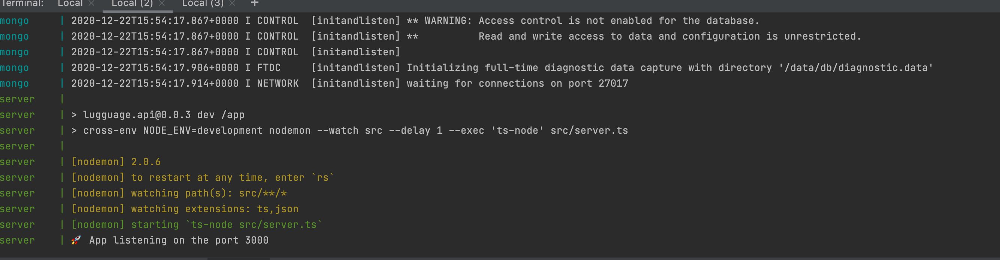

# Starter

## Pré-requis d'installation

L'api de starter est développée sous NodeJS avec comme DB Mongo.
Elle peut être lancée en local dans un containeur comme à l'exterieur.
L'application est entièrement dockerisée. ainsi pour la lancer, 
certaines appli doivent être installée avant.

- Docker
- Docker-compose
- Git
- Nodejs (v14 et plus) (pour l'utilisation hors container docker)
- Yarn

### Etape 1 - Installation Git

[Installer Git](https://www.codeflow.site/fr/article/how-to-install-git-on-debian-9)

### Etape 2 - Installation Docker

Installer docker via les instruction de Digital ocean (sous Ubuntu 20/Debian 10)

[Installer docker](https://www.digitalocean.com/community/tutorials/how-to-install-and-use-docker-on-ubuntu-20-04-fr)

### Etape 3 - Installation Docker-compose

[Installer docker-compose](https://www.digitalocean.com/community/tutorials/how-to-install-docker-compose-on-debian-10-fr)

NB: Installer la dernière version stable ([Consulter les releases docker-compose](https://github.com/docker/compose/releases))

### Etape 4 (facultative) - Installer NodeJS
Cette étape n'est pas nécessaire si on lance starter avec docker

Passez par le gestionnaire de packet NVM pour installer NodeJS

`curl -o- https://raw.githubusercontent.com/nvm-sh/nvm/v0.37.2/install.sh | bash`

Ou

`wget -qO- https://raw.githubusercontent.com/nvm-sh/nvm/v0.37.2/install.sh | bash`

Chargez nvm sur le terminal

`export NVM_DIR="$([ -z "${XDG_CONFIG_HOME-}" ] && printf %s "${HOME}/.nvm" || printf %s "${XDG_CONFIG_HOME}/nvm")"
[ -s "$NVM_DIR/nvm.sh" ] && \. "$NVM_DIR/nvm.sh"`

nvm install [version de node]. Exemple: `nvm install v14.14.0` pour la version 14.14.0 de NodeJS

## Lancer Starter

Une fois les pré-requis installés, clonez le présent repo

`git clone git@github.com:tchiss/starter-api.git starter-api`

se positionner dans le repertoire `starter-api`

`cd starter-api`

lancer starter-api via docker-compose

`docker-compose up`

starter-api est en mode développement sur [http://localhost/api](http://localhost/api) ou [http://localhost:3900/api](http://localhost:3900/api) comme l'image ci-dessous

vous pouvez consulter depuis le navigateur ou un client type postman
